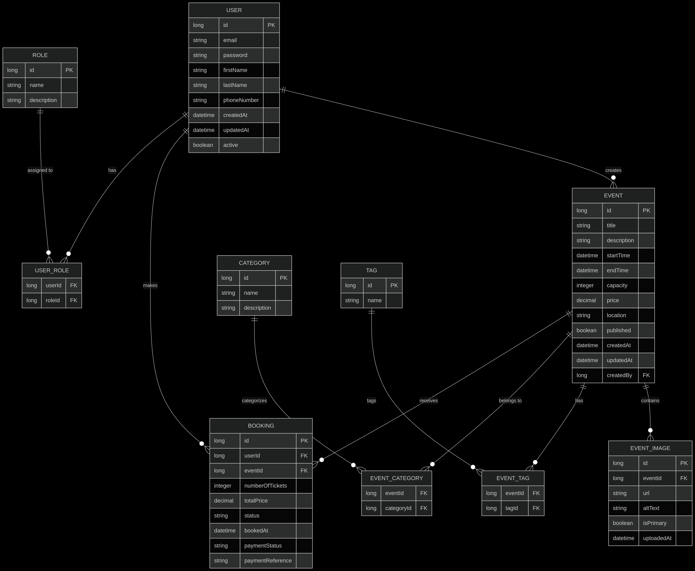

# Event Booking System

A full-stack event booking system built with Spring Boot that allows users to browse and book events, manage their bookings, and provides an integrated web-based admin panel for event management.

---
## ERD 

---
## Features

### Core Features
- **User Authentication & Authorization**
    - JWT token-based authentication
    - Role-based access control (Admin, Organizer, User)
    - User registration

- **Event Management**
    - Create, read, update, and delete events
    - Event details include title, description, date, time, location, capacity, and price
    - Published/unpublished event status

- **Booking System**
    - Book events with multiple tickets
    - View booking history
    - Cancel bookings
    - Booking confirmation notifications

- **Admin Panel**
    - Manage users, events, and bookings
    - View statistics and reports
    - Approve/reject event submissions

### Optional Enhancements
- **Role-Based Permissions** - Different access levels for admin, organizer, and regular users
- **Categories & Tags** - Organize events with categories and flexible tagging
- **Image Upload** - Upload and store event images
- **Pagination** - Efficient data loading for events and bookings lists
- **Responsive Design** - Mobile-friendly UI

## Tech Stack

- **Backend**: Spring Boot 3.2.x, Java 17
- **Database**: MySQL/PostgreSQL
- **Security**: Spring Security with JWT
- **API Documentation**: OpenAPI (Swagger)
- **Testing**: JUnit 5 with MockMvc
- **Build Tool**: Maven

## Project Structure

```
src/
├── main/
│   ├── java/com/eventbooking/
│   │   ├── config/              # Configuration classes
│   │   ├── controller/          # REST controllers
│   │   ├── dto/                 # Data Transfer Objects
│   │   ├── exception/           # Custom exceptions and handler
│   │   ├── entity/               # Entity classes
│   │   ├── enums/               # All Enum
│   │   ├── repository/          # Spring Data JPA repositories
│   │   ├── security/            # Security configurations and JWT
│   │   ├── service/             # Business logic
│   │   └── EventBookingApplication.java
│   │
│   └── resources/
│       ├── application.properties
│       ├── application-prod.properties
│       ├── db/migration/         # Database migrations
│       └── static/               # Static resources
│
└── test/
    └── java/com/eventbooking/
        ├── controller/           # Controller tests
        ├── repository/           # Repository tests
        └── service/              # Service tests
```

## API Endpoints

### Authentication
- `POST /api/auth/register` - Register a new user
- `POST /api/auth/login` - Login and get JWT token

### Events
- `GET /api/events` - Get all events (with filters)
- `GET /api/events/{id}` - Get event details
- `POST /api/events` - Create a new event (requires organizer/admin role)
- `PUT /api/events/{id}` - Update an event (requires ownership or admin)
- `DELETE /api/events/{id}` - Delete an event (requires ownership or admin)
- `GET /api/events/categories` - Get all categories
- `GET /api/events/tags` - Get all tags

### Bookings
- `GET /api/bookings` - Get user's bookings
- `POST /api/bookings` - Create a booking
- `GET /api/bookings/{id}` - Get booking details
- `PUT /api/bookings/{id}/cancel` - Cancel a booking

### Admin
- `GET /api/admin/users` - Get all users
- `PUT /api/admin/users/{id}/role` - Update user role
- `GET /api/admin/events` - Get all events (including unpublished)
- `PUT /api/admin/events/{id}/publish` - Publish/unpublish an event
- `GET /api/admin/bookings` - Get all bookings
- `GET /api/admin/stats` - Get system statistics

## Getting Started

### Prerequisites
- Java 17+
- MySQL/PostgreSQL
- Maven

### Installation

1. Clone the repository
```bash
git clone https://github.com/yourusername/event-booking-system.git
cd event-booking-system
```

2. Configure the database in `application.properties`
```properties
spring.datasource.url=jdbc:mysql://localhost:3306/eventbooking
spring.datasource.username=root
spring.datasource.password=yourpassword
```

3. Build the project
```bash
mvn clean install
```

4. Run the application
```bash
mvn spring-boot:run
```

5. Access the API at `http://localhost:8080`
6. API documentation is available at `http://localhost:8080/swagger-ui.html`

## Database Setup

The application uses Flyway for database migration. The migrations will run automatically when the application starts.

## Testing

Run tests with:
```bash
mvn test
```

## Deployment

The application can be deployed as a standalone JAR file.

```bash
java -jar target/event-booking-system-0.0.1-SNAPSHOT.jar
```

## Future Enhancements

- Payment integration
- Email notifications
- Event reminders
- Social sharing features
- Analytics dashboard
